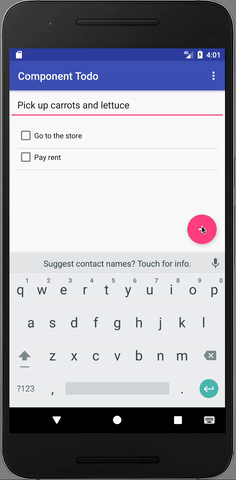

## RealmTodo Uni-Directional-Example App
This is a simple TodoApp that tracks todo items.  It is a companion example for a blog post I wrote regarding the use of Realm in Uni-Directional archicture.

Post: https://news.realm.io/news/eric-maxwell-uni-directional-architecture-android-using-realm

### Building

Clone the project and open in Android Studio, then run on an Emulator or Device.

### Screenshot

